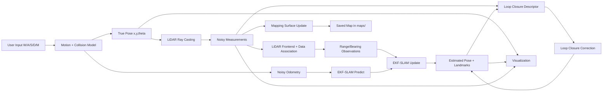
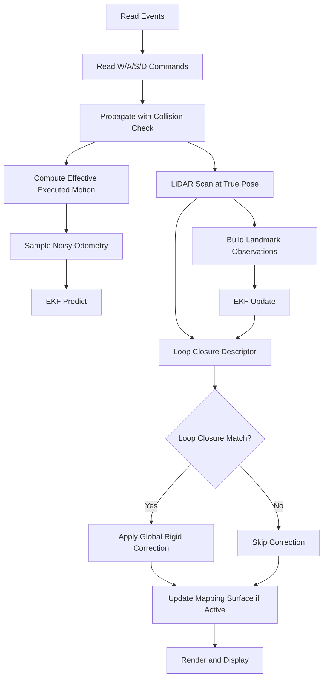
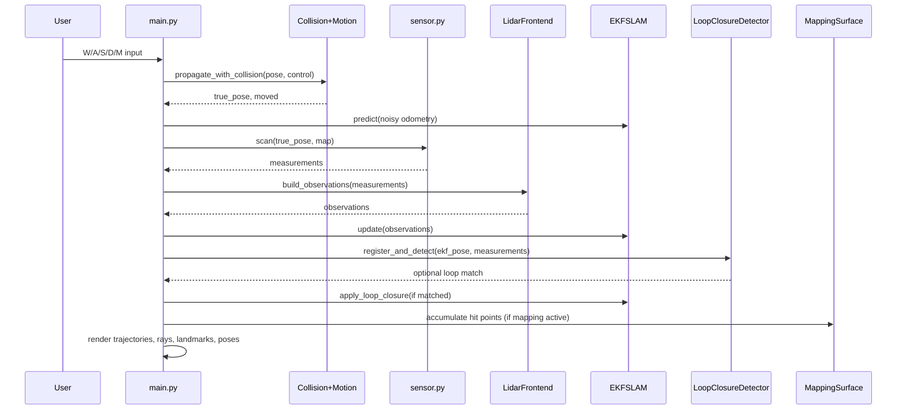

# Complete 2D SLAM Pipeline (Pygame)

This project implements an end-to-end 2D SLAM pipeline with:

- keyboard-controlled robot motion (`W/A/S/D`)
- collision-safe movement against black obstacles
- noisy odometry
- 360-degree LiDAR simulation with uncertainty
- scan frontend and landmark association
- EKF-SLAM (predict + update + landmark augmentation)
- loop-closure detection and global drift correction
- map generation with pause/save (`M` key)

## Quick Run

```bash
python3 main.py
```

## Controls

- `W`: move forward
- `S`: move backward
- `A`: turn left
- `D`: turn right
- `M`: toggle mapping pause/resume
  - when pressed while mapping is running, a map snapshot is saved to `maps/slam_map_YYYYMMDD_HHMMSS.png`

## Repository Structure

- `main.py`: runtime orchestrator and rendering loop
- `env.py`: map loading, display surface, point cloud drawing
- `sensor.py`: LiDAR ray-casting simulation and noisy measurements
- `slam.py`: motion, odometry, landmarks, EKF-SLAM, loop closure
- `map.png`: static occupancy-like world image (dark pixels are obstacles)

## System Architecture Graph



## Per-Frame Execution Graph



## Data Products and Types

- True state: `Pose2D(x, y, theta)`
- Odometry command sample: `(v_odom, w_odom)`
- LiDAR beam: `LidarMeasurement(angle_deg, distance, hit_point, hit)`
- EKF observation: `LandmarkObservation(landmark_id, range_m, bearing_rad)`
- EKF state vector:
  - `mu = [x, y, theta, l1x, l1y, l2x, l2y, ...]^T`
- EKF covariance:
  - `Sigma in R^(3+2N x 3+2N)`

## Coordinate and Unit Conventions

- map frame is image pixel frame
- origin at top-left
- +x right, +y down
- distance unit: pixel
- internal heading unit: radians
- LiDAR output angle shown in degrees (converted to radians when needed)

## Complete Mathematics

## 1) Robot Motion Model (Unicycle)

State at time `k`:

`x_k = [x, y, theta]^T`

Control over timestep `dt`:

`u_k = [v, w]^T`

If angular velocity is near zero (`|w| < eps`):

`x_{k+1} = x_k + v dt cos(theta_k)`

`y_{k+1} = y_k + v dt sin(theta_k)`

`theta_{k+1} = theta_k`

Else:

`x_{k+1} = x_k - (v/w) sin(theta_k) + (v/w) sin(theta_k + w dt)`

`y_{k+1} = y_k + (v/w) cos(theta_k) - (v/w) cos(theta_k + w dt)`

`theta_{k+1} = theta_k + w dt`

Angle wrapping:

`wrap(theta) = (theta + pi) mod (2pi) - pi`

## 2) Collision-Constrained Motion

Motion is split into rotation then translation:

1. apply rotation using `w`
2. test translated pose using `v`

A translated pose is blocked if any of these are true:

- robot center pixel is obstacle
- any sampled footprint ring point is obstacle
- point is out of bounds

Obstacle predicate from map color `(R,G,B)`:

`occupied = (R < threshold) AND (G < threshold) AND (B < threshold)`

So if there is a black line in front or behind, robot translation is rejected.

## 3) Odometry Noise Model

Commanded controls from keys are not used directly by EKF; noisy odometry is sampled:

`v_odom = v_eff + N(0, sigma_v^2)`

`w_odom = w_eff + N(0, sigma_w^2)`

where `v_eff, w_eff` come from actual executed motion after collision effects.

## 4) LiDAR Measurement Model

For each beam `i`:

Nominal angle:

`alpha_i = theta_robot + i * delta_alpha`

Noisy beam angle:

`alpha_i_tilde = alpha_i + N(0, sigma_alpha^2)`

Ray endpoint at distance `d`:

`p(d) = [x + d cos(alpha_i_tilde), y + d sin(alpha_i_tilde)]`

Ray marching searches first `d*` where either:

- `p(d)` leaves map bounds, or
- `p(d)` hits obstacle pixel

True range:

`r_true = d*`

Measured range:

`r_meas = clamp(r_true + N(0, sigma_r^2), 0, r_max)`

Measurement endpoint:

`p_meas = [x + r_meas cos(alpha_i_tilde), y + r_meas sin(alpha_i_tilde)]`

## 5) Landmark Observation Model

From LiDAR hits, nearest map landmark is selected (within association radius).

Observation for landmark `j`:

`z = [r, b]^T`

where:

- `r`: measured range
- `b`: measured bearing relative to robot heading

with bearing normalization:

`b = wrap(alpha_hit - theta_robot)`

## 6) EKF-SLAM State Definition

For `N` landmarks in state:

`mu = [x, y, theta, l1x, l1y, ..., lNx, lNy]^T`

Covariance:

`Sigma = cov(mu)`

## 7) EKF Prediction Step

Nonlinear process model:

`mu_bar = f(mu, u_odom)`

Covariance prediction:

`Sigma_bar = G Sigma G^T + R`

where:

- `G = df/dmu` (Jacobian of motion model)
- `R` injects process noise into robot block (top-left 3x3)

Key Jacobian entries used in code:

`G[0,2] = d x_{k+1} / d theta_k`

`G[1,2] = d y_{k+1} / d theta_k`

All landmark components are identity through prediction.

## 8) Landmark Initialization (State Augmentation)

If landmark is first seen, convert polar observation to Cartesian:

`lx = x + r cos(theta + b)`

`ly = y + r sin(theta + b)`

Append `[lx, ly]` to `mu` and grow `Sigma`.

Using Jacobians:

`Jr = d[lx,ly]/d[x,y,theta]`

`Jz = d[lx,ly]/d[r,b]`

and measurement noise:

`Q = diag(sigma_r^2, sigma_b^2)`

New landmark covariance block:

`Sigma_ll = Jr Sigma_rr Jr^T + Jz Q Jz^T`

Cross-covariances are added with existing state.

## 9) EKF Measurement Update

For known landmark `j`:

`dx = lx - x`

`dy = ly - y`

`q = dx^2 + dy^2`

Predicted measurement:

`z_hat = [sqrt(q), wrap(atan2(dy,dx) - theta)]^T`

Innovation:

`nu = z - z_hat`

`nu[1] = wrap(nu[1])`

Measurement Jacobian `H` is built w.r.t robot and landmark states.

Innovation covariance:

`S = H Sigma_bar H^T + Q`

Kalman gain:

`K = Sigma_bar H^T S^-1`

State correction:

`mu = mu_bar + K nu`

Covariance correction:

`Sigma = (I - K H) Sigma_bar`

Then symmetrization is applied numerically.

## 10) Loop Closure Mathematics

## Descriptor

Each scan distance array is binned into `B` chunks.

Descriptor value for bin `b`:

`d_b = mean(range values in bin b)`

Descriptor distance to old frame `t`:

`score_t = mean(|d_now - d_t|)`

A candidate is valid if:

- frame separation > minimum
- pose distance < spatial threshold
- `score_t < descriptor_threshold`

## Correction transform

If matched to target pose `(x_t, y_t, theta_t)` from current estimated pose `(x_c, y_c, theta_c)`:

`dtheta = wrap(theta_t - theta_c)`

Rotation matrix:

`R = [[cos dtheta, -sin dtheta], [sin dtheta, cos dtheta]]`

Translation chosen so corrected current pose maps to target:

`[tx, ty]^T = [x_t, y_t]^T - R [x_c, y_c]^T`

Apply to robot and all landmark points `p`:

`p' = R p + t`

Heading update:

`theta' = wrap(theta + dtheta)`

Covariance is slightly inflated after correction to avoid overconfidence.

## 11) Mapping Surface Update

When mapping is active:

- every LiDAR hit point is reprojected using the EKF estimated pose and drawn black on a white canvas
- this acts as an accumulated map estimate from scan endpoints

On save (`M`):

- current mapping surface is copied
- true/estimated trajectories are drawn for diagnostics
- result is written to `maps/` with timestamp filename

## Main File-Level Data Flow



## Worked Numeric Example (One Timestep)

This example shows one simplified EKF-SLAM step with concrete values.

Assume current robot estimate:

- `x = 100.0 px`
- `y = 80.0 px`
- `theta = 0.20 rad` (about 11.46 deg)

Control and timestep:

- `v_cmd = 90 px/s`
- `w_cmd = 0.40 rad/s`
- `dt = 0.10 s`

### 1) Motion propagation (true model)

Using the non-zero `w` equations:

- `theta' = 0.20 + 0.40*0.10 = 0.24 rad`
- `x' = x - (v/w)sin(theta) + (v/w)sin(theta + wdt)`
- `y' = y + (v/w)cos(theta) - (v/w)cos(theta + wdt)`

Numerically (rounded):

- `x' ≈ 108.78`
- `y' ≈ 81.93`
- `theta' = 0.24`

### 2) Odometry sample used by EKF predict

Assume sampled odometry noise:

- `v_odom = 90 + N(0,2^2) -> 91.3 px/s`
- `w_odom = 0.40 + N(0,0.02^2) -> 0.385 rad/s`

EKF predict uses `(v_odom, w_odom)` and updates `(mu_bar, Sigma_bar)`.

### 3) One LiDAR hit and observation

Suppose one beam reports:

- noisy beam angle `alpha = 38 deg = 0.663 rad`
- measured range `r = 52 px`

Bearing relative to robot:

- `b = wrap(alpha - theta_true) = wrap(0.663 - 0.24) = 0.423 rad`

Observation vector:

- `z = [52, 0.423]^T`

### 4) Predicted measurement to known landmark

Suppose EKF currently stores landmark `j` at:

- `l_j = (155, 105)`

From predicted robot state `(x_bar, y_bar, theta_bar) = (108.6, 82.1, 0.235)`:

- `dx = 155 - 108.6 = 46.4`
- `dy = 105 - 82.1 = 22.9`
- `q = dx^2 + dy^2 = 2678.57`
- `r_hat = sqrt(q) = 51.75`
- `b_hat = wrap(atan2(22.9,46.4) - 0.235) = 0.223`

So:

- `z_hat = [51.75, 0.223]^T`
- `nu = z - z_hat = [0.25, 0.200]^T`

### 5) EKF correction (conceptual)

Given Jacobian `H`, innovation covariance `S`, and gain `K`:

- `K = Sigma_bar H^T S^-1`
- `mu = mu_bar + K nu`
- `Sigma = (I - K H) Sigma_bar`

Interpretation:

- positive bearing residual (`+0.200 rad`) pulls heading/pose to align with the observed direction
- range residual (`+0.25 px`) slightly shifts position and landmark estimate
- covariance shrinks along observed directions

### 6) Loop-closure example (same run, later frame)

Suppose current estimated pose is `(300, 180, 1.10)` and matched historic pose is `(290, 175, 1.00)`:

- `dtheta = wrap(1.00 - 1.10) = -0.10 rad`
- `R = [[cos(-0.10), -sin(-0.10)], [sin(-0.10), cos(-0.10)]]`
- `t = [290, 175]^T - R[300,180]^T`

Then every robot/landmark point is corrected with:

- `p' = R p + t`

This globally reduces drift after revisiting a known place.

## Mathematical Assumptions

- map is static and known for collision and synthetic sensing
- obstacle pixels are dark enough to pass threshold test
- odometry and LiDAR noise are zero-mean Gaussian
- data association is nearest-neighbor in Euclidean endpoint space
- loop closure uses descriptor similarity + spatial gating

## Practical Limitations

- no full graph-SLAM optimizer backend
- data association can fail in repetitive geometries
- loop closure correction is rigid transform, not full nonlinear optimization
- mapping surface is endpoint accumulation, not a probabilistic occupancy grid
- dynamic obstacles are not modeled

## Suggested Upgrades

1. Replace nearest-neighbor association with Mahalanobis gating + JCBB.
2. Replace rigid loop correction with pose-graph optimization.
3. Add log-odds occupancy grid update from full inverse sensor model.
4. Use robust loss in update/closure steps for outlier resistance.
5. Add trajectory/map metrics (ATE, RPE, IoU) and experiment logging.
